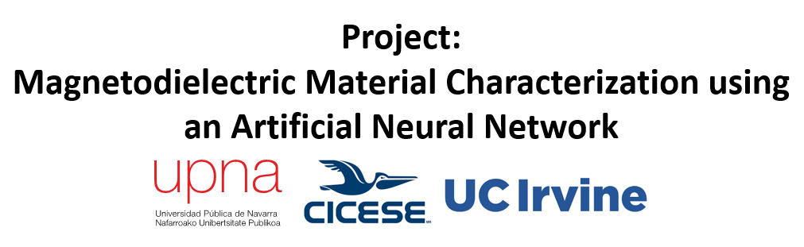

  

This repository contains the dataset and the notebook used to train an ANN to retrieve the permittivity and permeability of a magnetodielectric material. The training data were obtained from the analysis of the SRR sensor’s frequency response.

### Autors: 
G. Álvarez-Botero1, N. Duque-Madrid1, H. Lobato-Morales2, G. Méndez-Jerónimo2, K. Hui3, N. Tarabay3, A. Pons-Abenza1, I. Arregui1, T. Lopetegi1, M. A. G. Laso1, C. Velez3

1 Institute of Smart Cities (ISC), Department of Electrical, Electronic and Communications Engineering, Public University of Navarre (UPNA), Campus Arrosadia, 31006 Pamplona, España.  
2 Departamento de Electrónica y Telecomunicaciones, CICESE, Ensenada 22860, México.  
3 Mechanical and Aerospace Engineering Department, Magnetic Microsystems and Microrobotics Laboratory, University of California, Irvine, CA 92697, USA.
#### If you use these resources, please cite:

(Insert Reference here)
